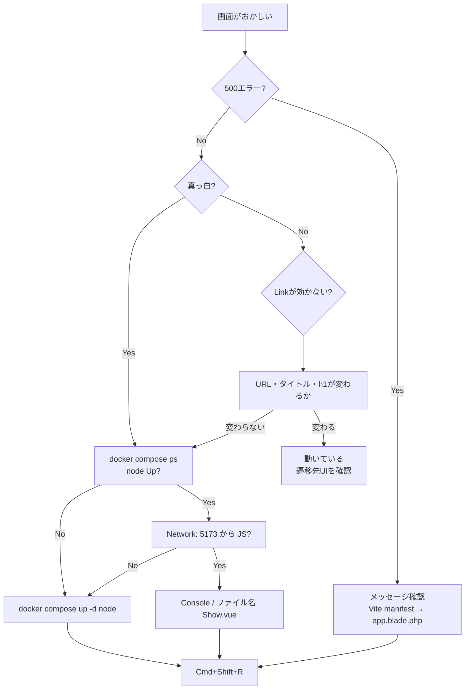

# 新しいVueファイルを書いたときに、表示されないときの対処法

## 症状から入る

| 症状 | まず疑うこと |
|------|----------------|
| **真っ白な画面** | Vite（`node`）停止 / 古い `public/build` |
| **500 + Vite manifest エラー** | `@vite` の書き方 / ビルド未実行 |
| **Link を押しても変わらない** | 遷移はしているが変化が小さい / `node` 停止 / コンポーネント名不一致 |
| **一部のページだけおかしい** | `Show.vue` vs `show.vue` など **大文字小文字** |

---

## 基本フロー（5分チェック）

### 1. Docker が全部 Up か

```bash
docker compose ps
```

| コンテナ | 役割 | 落ちていたら |
|----------|------|----------------|
| `practice-vue-app` | Laravel（8080） | `docker compose up -d app` |
| `practice-vue-node` | **Vite（5173）** | `docker compose up -d node` |
| `practice-vue-db` | DB | `docker compose up -d` |

**Vue / Inertia を触っているときは `node` が Up であることが必須**です。

---

### 2. Vite が動いているか

```bash
docker compose logs node --tail 30
```

**OK の例:**

```text
VITE v7.x.x  ready in ...
➜  Local:   http://localhost:5173/
```

**NG の例:**

- `Exited (1)`
- `ENOENT: ... Show.vue` など → ファイル欠落・名前不一致

**復旧:**

```bash
docker compose up -d node
# 直らなければ
docker compose restart node
```

ブラウザで **Cmd+Shift+R**（スーパーリロード）。

---

### 3. ブラウザが何を読んでいるか

開発者ツール → **Network** → ページ再読み込み。

| 読み込み元 | 意味 |
|------------|------|
| `http://localhost:5173/...` | Vite 開発モード（正常） |
| `http://localhost:8080/build/assets/...` のみ | Vite 停止中 → **古いビルド**を使用 |

`5173` が無い → **手順2** に戻る。

---

### 4. Console（あれば）

- 赤エラー → 内容をそのまま検索
- **エラーなしで Link が効かない** → URL バー・見出し・タブタイトルが変わるか確認（SPA 遷移は地味）

---

### 5. Laravel 側のエラーか

- 画面に Laravel のエラーページ（500）→ メッセージを読む  
  - `Unable to locate file in Vite manifest` → **`app.blade.php` は `@vite(['resources/js/app.js'])` だけ**か確認
- 白画面だけ → 多くは **手順2〜3（Vite）**

---

## よくある原因と対処

### A. `node` が落ちた（今回いちばん多い）

**原因例:** 存在しない `.vue` を参照、私のような誤削除で `ENOENT`

**対処:**

```bash
docker compose up -d node
docker compose logs -f node   # エラーが出続けないか確認
```

ファイルが揃っているか:

```bash
ls resources/js/Pages/Inertia/
# Index.vue, Show.vue など、コントローラの Inertia::render('Inertia/Show') と一致するか
```

---

### B. コンポーネント名とファイル名の不一致

| コントローラ | ファイル名（Docker/Linux） |
|--------------|---------------------------|
| `Inertia::render('Inertia/Show')` | `resources/js/Pages/Inertia/Show.vue` |
| `Inertia::render('Inertia/Index')` | `.../Inertia/Index.vue` |

Mac では `show.vue` と `Show.vue` が同じに見えることがあります。**Docker 内では別ファイル**です。

**リネームするときは削除しない:**

```bash
git mv resources/js/Pages/Inertia/show.vue resources/js/Pages/Inertia/Show.vue
# または二段階
git mv show.vue Show.vue.tmp && git mv Show.vue.tmp Show.vue
```

---

### C. `@vite` にページを直書きしている

**NG:**

```blade
@vite(['resources/js/app.js', "resources/js/Pages/{$page['component']}.vue"])
```

**OK（Breeze 標準）:**

```blade
@vite(['resources/js/app.js'])
```

ページは `app.js` の `import.meta.glob('./Pages/**/*.vue')` で読み込みます。

---

### D. Vite が止まっていてビルドだけ古い

**開発中:** `node` を起動すれば足りる（`public/build` は触らなくてよい）

**どうしても `node` なしで見たいときだけ:**

```bash
docker compose exec node npm run build
```

---

## クイックリファレンス（コピペ用）

```bash
# 1. 状態確認
docker compose ps

# 2. node 復旧
docker compose up -d node

# 3. Vite ログ
docker compose logs node --tail 50

# 4. ルート確認
docker compose exec app php artisan route:list --name=inertia

# 5. ページが返るか
curl -s -o /dev/null -w "%{http_code}\n" http://localhost:8080/inertia-test
curl -s -o /dev/null -w "%{http_code}\n" http://localhost:5173/resources/js/app.js
```

- `8080` → 200、`5173` → 000 → **`node` を直す**  
- 両方 200 → ブラウザをスーパーリロード

---

## 判断の流れ（図）



---

## 日常の習慣（予防）

1. 作業開始: `make up` または `docker compose up -d` → **`node` が Up か確認**
2. おかしいとき: まず `docker compose logs node --tail 20`
3. `.vue` のリネーム: **削除せず `git mv`**
4. Inertia のページ追加後: コントローラの `'Inertia/Show'` と **ファイル名の先頭大文字**を揃える

---

このフローで、今回のような「白画面」「manifest エラー」「Link が効かないように見える」はほぼ切り分けできます。特定の症状で止まったら、その時点の `docker compose ps` と `docker compose logs node --tail 30` を貼ってもらえれば、そこから一緒に追えます。